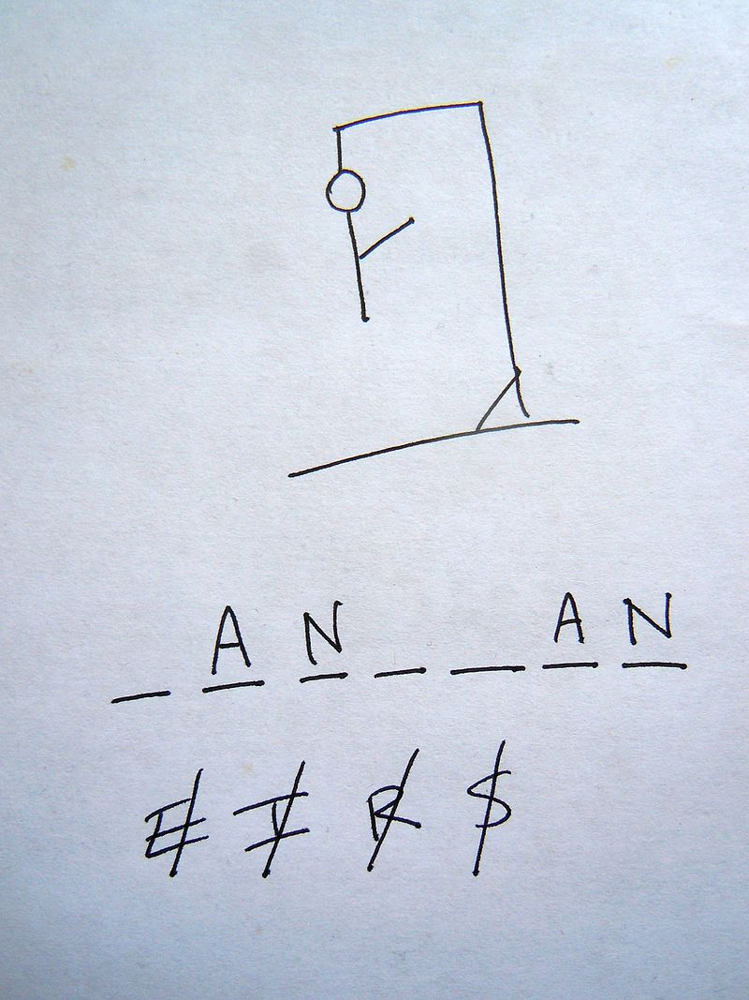

# Hangman Game
Hangman game is a paper and pencil guessing game for two or more players. One player thinks of a word,  and the other(s) tries to guess it by suggesting letters within a certain number of wrong guesses.  
 Hangman游戏是一个纸笔猜词游戏，适合两个或多个玩家。一个玩家想一个单词，而其他人则试图在一定数量的错误猜测内猜出它。

https://en.wikipedia.org/wiki/Hangman_(game)  
### Game Overview:
The word to guess is represented by a row of dashes, representing each letter of the word.  
If the guessing player suggests a letter which occurs in the word, the other player writes it in all its correct positions. The guessing player then continue guessing the next letter. (Succesful guess does not count toward total chances.)  
If the suggested letter does not occur in the word, the other player draws one element of a hanged man stick figure as a tally mark. (Or say, losing one chances of guessing.)  
If the guessing player loses all chances, which is usually 6, representing head, body, two arms and two legs, he/she is then 'hanged' and loses the game.  

游戏概述：
要猜测的单词由一排破折号表示，表示单词的每个字母。 
如果猜字的玩家建议一个单词中出现的字母，其他玩家会将其写在所有正确的位置上。然后，猜字的玩家继续猜下一个字母。（成功猜测不计入总机会。） 
如果建议的字母不在单词中出现，其他玩家会画一个吊死人的图案的一个部分作为计数标记。（或者说，失去了一个猜字的机会。） 
如果猜字的玩家失去了所有机会，通常是6次，表示头部、身体、两只胳膊和两条腿，那么他/她就会被“吊死”并输掉游戏。 

### An example:
Secret word: Hangman,   
Total chance: 6.

1st guess: e: _ _ _ _ _ _ _; Chances left: 5;  
2st guess: a: _ a _ _ _ a _; Chances left: 5;  
3st guess: n: _ a n _ _ a n; Chances left: 5;  
4st guess: t: _ a n _ _ a n; Chances left: 4;  
5st guess: e: _ a n _ _ a n; Chances left: 3;  
6st guess: g: _ a n g _ a n; Chances left: 3;  
7st guess: h: h a n g _ a n; Chances left: 3;  
8st guess: m: h a n g m a n; Chances left: 3;  
**Then this is a success!**
一个例子：
秘密单词：Hangman， 
总机会：6。

第1次猜测：e：_ _ _ _ _ _ ; 剩余机会：5; 
第2次猜测：a： a _ _ _ a ; 剩余机会：5; 
第3次猜测：n： a n _ _ a n; 剩余机会：5; 
第4次猜测：t：_ a n _ _ a n; 剩余机会：4; 
第5次猜测：e：_ a n _ _ a n; 剩余机会：3; 
第6次猜测：g：_ a n g _ a n; 剩余机会：3; 
第7次猜测：h：h a n g _ a n; 剩余机会：3; 
第8次猜测：m：h a n g m a n; 剩余机会：3; 
然后这就是成功了

## My work
Developed the game framework in the Jupyter Notebook.  
It includes:
* Raw training and testing words.
* Functions to generate a secret word, start the game and keep track of it.
* Functions applying ***my strategy*** to guess the word.
我的工作
在Jupyter Notebook中开发了游戏框架。 
它包括：

原始的训练和测试单词。
生成秘密单词、开始游戏和跟踪游戏的功能。
应用 我的策略 来猜测单词的功能。

## My strategy
A data scientist may find this NLP problem well-suited for Machine Learning and Nerual Networks. *However, my strategy is inspired by what human really think when guessing an English word - **we focus on substrings**.*

English words usually consist of common substrings, such as '-tion', '-ness', 'pre-', '-it-', 're-', '-en-'......  
I first abstract these substrings from the training corpus, and count their occurrencies, then use these substrings to match the substring in the masked secret word.  
For example, the current masked word is: 'l e a r _ i _ g', a very common substring 'ing' matches with the current mask 'i _ g', showing that this masked letter is very likely to be an 'n'.  
I apply this method to each position, calculating the possibilities of it being each letter by matching substrings to it and its neighbours. Then I guess the letter that has max possibility in each round. 

This strategy reaches 56% accuracy guessing the word from both train and test corpus. It is a good result since there are many English words with unusual construction and letters. It also out-performs the Neural Networks that others developed, in both running time and accuracy.

Please go into the notebook to see detailed examples of game playing and strategies.  
*Don't forget to try providing a secret by yourself!*

我的策略
一个数据科学家可能会发现这个NLP问题非常适合机器学习和神经网络。然而，我的策略受到人们在猜测英语单词时的真实思考的启发 - 我们专注于子字符串。

英语单词通常由常见的子字符串组成，例如'-tion'，'-ness'，'pre-'，'-it-'，'re-'，'-en-'......  
我首先从训练语料库中提取这些子字符串，并统计它们的出现次数，然后使用这些子字符串来匹配掩码的秘密单词中的子字符串。 
例如，当前的掩码单词是：'l e a r _ i _ g'，一个非常常见的子字符串'ing'与当前掩码 'i _ g'匹配，表明这个掩码字母很可能是一个'n'。 
我将这种方法应用于每个位置，通过将子字符串与其邻居进行匹配来计算它是每个字母的可能性。然后，我在每轮中猜测具有最大可能性的字母。 

这种策略在从训练和测试语料库中猜测单词时达到了56%的准确率。这是一个很好的结果，因为有许多英语单词具有不寻常的构造和字母。它在运行时间和准确率上也优于其他人开发的神经网络。

请进入笔记本以查看游戏玩法和策略的详细示例。 
别忘了尝试自己提供一个秘密单词！

